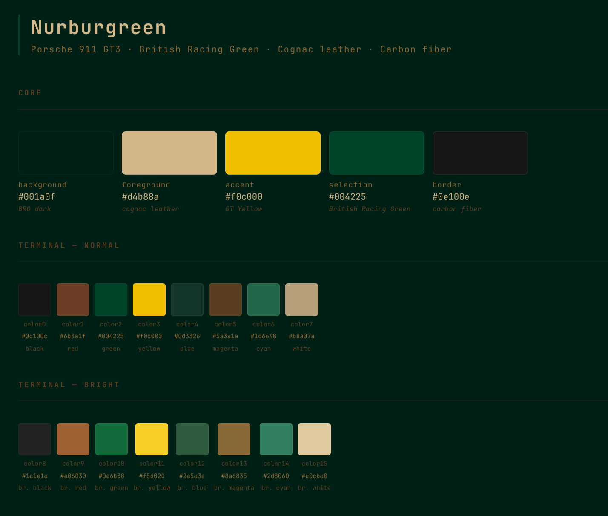

# dotdotdots

My dotfiles. Arch Linux, [Omarchy](https://omarchy.org/), Hyprland. Managed with GNU Stow.

Not trying to be a framework. Not trying to be portable. This is what I run.

---

## Stack

| Layer | Tool |
|---|---|
| OS | Arch Linux |
| WM | Hyprland (via Omarchy) |
| Shell | Bash |
| Terminal | Ghostty + tmux |
| Editor | Neovim (LazyVim) |
| Bar | Waybar |

---

## Structure

```
dotdotdots/
├── .config/
│   ├── bash/
│   │   ├── aliases.bash       # shell aliases (git, ls, nav)
│   │   ├── exports.bash       # PATH, FZF, env vars
│   │   ├── work.bash          # work-specific aliases (loaded conditionally)
│   │   └── local.bash.sample  # machine-local secrets template (gitignored)
│   ├── hypr/                  # Hyprland overrides on top of Omarchy defaults
│   │   ├── looknfeel.conf     # borders, blur, shadows, window rules
│   │   ├── bindings.conf      # keybindings
│   │   ├── monitors.conf      # display config
│   │   └── ...
│   ├── tmux/tmux.conf         # Nurburgreen theme, vim nav, claude status bar
│   ├── nvim/                  # LazyVim config + Nurburgreen lualine theme
│   ├── waybar/                # bar layout + glass style
│   ├── ghostty/               # terminal config
│   ├── starship.toml          # prompt
│   ├── omarchy/themes/nurburgreen # custom Nurburgreen theme (see below)
│   └── claude/                # Claude Code settings
├── bin/
│   ├── waybar-claude-todo     # reads ~/todo/TODO.md, outputs JSON for waybar
│   ├── todo-popup             # opens todo in floating ghostty+nvim
│   ├── tmux-claude-status     # shows active Claude Code sessions in tmux bar
│   └── dev-tmux               # spins up dev environment windows
└── wallpapers/
```

---

## Nurburgreen Theme

Custom theme built around a Porsche 911 GT3 in British Racing Green.



```
background  #001a0f   BRG dark
foreground  #d4b88a   cognac leather
accent      #f0c000   GT yellow (used sparingly)
border      #0e100e   carbon fiber
```

Applied consistently across terminal, tmux, waybar, neovim, starship, eza, fzf.

---

## Setup

Requires GNU Stow.

```bash
git clone https://github.com/brieucdlf/dotdotdots ~/.dots
cd ~/.dots
stow .
```

Machine-local config (API keys, work email, etc.) goes in `~/.config/bash/local.bash` — copy from `local.bash.sample`, never committed.

---

## AI Integration

tmux status bar shows active Claude Code sessions via `bin/tmux-claude-status`.

Waybar center shows a personal todo count (`bin/waybar-claude-todo`) backed by `~/todo/TODO.md`. Clicking opens a floating editor. The todo directory runs a Claude Code agent that syncs with Anytype via MCP.

---

## Notes

- Omarchy manages the base system. These dotfiles are overrides only — `~/.local/share/omarchy/` is never touched.
- `work.bash` loads conditionally (`~/Repos/bloomflow` must exist) — fresh machines don't break.
- Hyprland reloads most changes live. Waybar needs `omarchy restart waybar`.
