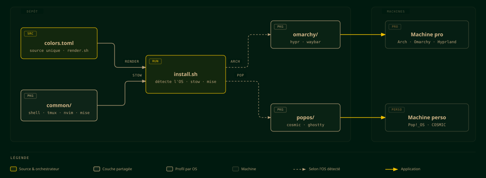

# dotdotdots

Mes dotfiles, sur deux machines :

| Machine | OS | Desktop | Profil |
|---|---|---|---|
| pro | Arch + [Omarchy](https://omarchy.org/) | Hyprland | `omarchy` |
| perso | Pop!_OS 24.04 | COSMIC | `popos` |

Le terminal, le thème et les outils CLI sont **identiques** sur les deux. Le
desktop ne l'est pas, et n'essaie pas de l'être.

---

## Installation

```bash
git clone git@github.com:brieucdlf/dotdotdots ~/.dotfiles
cd ~/.dotfiles && ./install.sh
```

Le script détecte le profil, installe les paquets manquants, stow les paquets,
rend le thème et lance `mise install`. Il est idempotent — relançable à volonté.

Il déblaie aussi le terrain avant de stower, parce qu'un seul conflit fait
avorter stow **en entier** et laisse la machine sans ancienne config ni
nouvelle :

- tout ce qui existe déjà et bloquerait stow — vrai fichier, mais aussi lien
  posé par un autre outil, sur un fichier comme sur un dossier — part dans
  `~/.dotfiles-backup/<horodatage>/`, jamais écrasé ;
- les liens de `~` qui pointent dans le repo vers un chemin disparu (après un
  renommage, par exemple) sont retirés : ils ne contiennent rien.

Si stow refuse quand même, le script s'arrête en disant où sont les fichiers
écartés — plutôt que de mourir sur l'erreur brute de stow.

```bash
./install.sh --profile popos   # forcer un profil
./install.sh --no-packages     # stow + thème seulement
```

---

## Les trois couches



**La règle qui tranche : si ça tourne dans un terminal → `common/`. Si ça dépend
du compositeur ou du gestionnaire de paquets → un profil.**

```
common/            # les 2 machines, identique au byte près
├── .bashrc                     # loader : Omarchy si présent, puis init.bash
├── .gitconfig
├── .config/
│   ├── bash/init.bash          # socle shell indépendant de la distro
│   ├── bash/{exports,aliases,work}.bash
│   ├── ghostty/  tmux/  nvim/  starship.toml
│   ├── mise/config.toml        # ← versions des outils, la clé de l'iso
│   └── zed/
├── .claude/                    # config Claude Code (settings, skills, statusline)
└── .local/bin/                 # claude-panel, tmux-claude-status, dots-shell-dump

theme/
├── nurburgreen/    # colors.toml = SOURCE UNIQUE des couleurs (+ ui.toml)
├── cosmic/         # palette sémantique stock de COSMIC, reprise telle quelle
└── render.sh       # → ~/.config/theme/current/{ghostty,tmux,colors.sh,*.ron}

omarchy/            # hypr/, waybar/
popos/              # thème COSMIC + override ghostty (voir son README)
```

`common/` et le profil sont stowés **en une seule invocation**
(`stow --restow common $PROFILE`) : traités séparément, stow refuse de déplier
un dossier posé par l'autre passage.

---

## Thème Nurburgreen

Construit autour d'une Porsche 911 GT3 en British Racing Green.


```
background  #001a0f   BRG dark
foreground  #d4b88a   cognac leather
accent      #f0c000   GT yellow (used sparingly)
```

`theme/nurburgreen/colors.toml` est la seule source de vérité. `theme/render.sh`
en dérive les fichiers consommés par ghostty, tmux, fzf et eza dans
`~/.config/theme/current/` — **aucune couleur n'est codée en dur dans une config**.
Les tokens qui n'existent pas dans le format Omarchy (bordures, fond de barre)
sont dans `ui.toml`, à côté.

Changer une couleur = éditer `colors.toml`, relancer `./install.sh --no-packages`.

Sur la machine Omarchy, `install.sh` lie aussi le thème dans le sélecteur Omarchy
pour que Waybar et Hyprland le voient. Le terminal, lui, ne dépend pas d'Omarchy :
c'est ce qui rend l'iso vraie.

Sur Pop!_OS, le desktop COSMIC a droit au même traitement : `render.sh` produit
un `cosmic-nurburgreen-dark.ron` importable via **Réglages > Apparence >
Importer un thème**. Détail du mapping dans `popos/README.md`.

---

## Iso des outils

`common/.config/mise/config.toml` fixe les versions de tout le socle CLI
(eza, fzf, zoxide, starship, delta, lazygit, fd, rg, btop, bat, gh, jq, neovim)
en plus des runtimes. Un `mise install` et les deux machines ont les mêmes
binaires, indépendamment d'apt et de pacman.

⚠️ Sur la machine Omarchy, les shims mise passent devant les binaires pacman.
C'est voulu.

Restent hors mise, installés par `install.sh` : **ghostty** (`.deb`
[mkasberg/ghostty-ubuntu](https://github.com/mkasberg/ghostty-ubuntu) sur Pop,
pacman sur Arch), **tmux**, **stow** et la **JetBrainsMono Nerd Font**.

### Vérifier que les deux machines ont convergé

Le socle shell vient d'Omarchy sur la machine pro et de `init.bash` sur Pop :
rien ne garantit qu'ils soient identiques. Pour rendre l'écart visible :

```bash
dots-shell-dump > ~/shell-$(hostname).txt   # sur chaque machine
diff ~/shell-pro.txt ~/shell-perso.txt
```

Ce qui manque côté Pop est à recopier dans `common/.config/bash/init.bash`.

---

## Machine-specific

Rien de tout ça n'est committé :

| Fichier | Usage |
|---|---|
| `~/.config/bash/local.bash` | secrets, clés API, overrides — sourcé en dernier |
| `~/.config/bash/work.bash` | aliases pro : noms de projets internes |
| `~/.config/git/identity.gitconfig` | nom et email git |
| `~/.config/zed/mcp.json` | serveurs MCP de Zed (endpoints internes) |
| `~/.local/bin/dev-tmux` | lanceur de session tmux propre au boulot |
| `~/.config/ghostty/local.conf` | `font-size` selon le DPI ; posé par le profil popos pour l'opacité |
| `~/.config/git/work.gitconfig` | identité pro, appliquée d'office sous `~/Work/` |
| `omarchy/.config/hypr/monitors.conf` | résolutions et scaling (committé, mais par profil) |
| `common/.claude/settings.private.json` | bloc `autoMode` de Claude Code, extrait par le filtre git |

Chacun a son `.sample` committé à côté, qui montre la structure sans nommer
l'employeur, les projets internes ni l'identité. `work.bash` n'est chargé que
s'il existe — une machine fraîche ne casse pas.

---

## Claude Code

`~/.claude/` est stowé depuis `common/.claude/` : `settings.json`, les skills
perso et la statusline suivent d'une machine à l'autre.

⚠️ Le chemin qui compte est `~/.claude/`, **pas** `~/.config/claude/` — Claude
Code ne lit jamais ce dernier. Il n'existe pas non plus de
`~/.claude/settings.local.json` : le suffixe `.local` n'a de sens qu'au niveau
d'un projet.

`~/.claude/settings.json` est un **lien** vers le dépôt, et c'est volontaire :
Claude Code écrit lui-même dans ce fichier (`/config`, thème, effort, plugins
activés), donc ses réglages atterrissent directement dans le dépôt, prêts à
committer. S'il venait à remplacer le lien par un vrai fichier — écriture
atomique, comme `cosmic-settings` —, `install.sh` récupère le contenu et
re-soude le lien.

Ne sont **pas** suivis : les serveurs MCP (ils vivent dans `~/.claude.json`,
mélangés à l'OAuth et aux caches, chaînes de connexion en clair), l'historique
(`projects/`, 169 Mo), les plugins (ils se réinstallent seuls depuis
`enabledPlugins`). Sur une machine neuve, les MCP sont à rejouer à la main :

```bash
claude mcp add anytype ...
claude mcp add mongodb ...
```

### Le bloc autoMode et le filtre git

Ce dépôt est **public**, et `settings.json` porte un bloc `autoMode.environment`
qui décrit l'environnement de travail (dépôt privé, bases Notion, politique de
traitement des données personnelles). Un filtre git le retire :

| | |
|---|---|
| `.gitattributes` | associe le fichier au filtre `claude-settings` |
| `.githooks/claude-settings-filter` | `clean` retire le bloc et l'archive ; `smudge` le réinjecte |
| `common/.claude/settings.private.json` | l'archive, gitignorée |
| `.githooks/pre-commit` | refuse le commit si le bloc atteint quand même l'index |

Les deux sens comptent. Sans `smudge`, le filtre serait **destructeur** : un
`git stash`, un `git checkout` ou un `reset --hard` fait transiter le fichier par
l'index et le bloc disparaîtrait de la config vivante, sans un mot.

`install.sh` configure le tout (`filter.claude-settings.*`, `core.hooksPath`),
avec `required = true` — un `jq` absent fait échouer l'indexation au lieu de
publier le fichier brut. **Un clone sur lequel `install.sh` n'a pas tourné n'a
pas cette protection** : le hook `pre-commit` est là pour ce cas.

### Le panneau

Le panneau n'existe que dans les fenêtres tmux qui font tourner Claude Code. Il
s'ouvre et se ferme tout seul : les hooks `SessionStart` et `SessionEnd`
appellent `tmux-claude-panel`, qui réconcilie **toutes** les fenêtres avec les
sessions vivantes. Une fenêtre `docker` ou `npm` n'en verra jamais.

La détection ne devine rien : chaque session Claude écrit son emplacement dans
`~/.claude/sessions/<pid>.json`, au format `session:@fenêtre.%pane`. Le script
lit ce champ et vérifie que le pid vit encore.

`prefix + a` reste la commande manuelle, et cycle sur trois états :

```
fermé  ──▶  large (44 col)  ──▶  replié (5 col)  ──▶  fermé
```

Dans une fenêtre sans session Claude, il refuse et le dit. Fermer à la main pose
une option de fenêtre `@claude_panel_off` : sans elle, le premier hook venu
rouvrirait le panneau et « fermer » ne voudrait rien dire. Le drapeau vit le
temps de la fenêtre ; `prefix + a` le lève.

Deux détails qui évitent des faux positifs : à `SessionStart` le fichier de
session n'est pas forcément encore écrit, donc le hook fait compter d'office son
propre pane ; à `SessionEnd` le processus est encore vivant, donc le hook exclut
la session qui se termine — sinon elle se compterait elle-même et le panneau
resterait. Comme `SessionEnd` part aussi pour les sous-agents, l'exclusion porte
sur le `session_id` et non sur le pane : exclure un sous-agent ne retire rien, la
session parente tient le panneau ouvert.

```
 CLAUDE                               13:49      ∘
                                                 ⠹
 AGENTS                                   4      ∙
 ▸ ∘ migration-schema-v2       12j  bloqué       ∙
      attend un go avant de committer…           4
   ⠹ dotfiles-setup                     3h
   ∙ mon-autre-projet-b2                3h      5h
                                               27%
 QUOTA                                          7j
   5 h   ████░░░░░░░░░░░░    27%   ↻ 1h20      17%
   7 j   ███░░░░░░░░░░░░░    17%   ↻ 3j04h

 CONSO
   aujourd'hui     8.1M tok     ~6.40 $
   7 jours        42.3M tok    ~33.80 $

   opus-5          8.1M  ██████████████
```

Quand le pane a le focus, la liste est navigable :

| | |
|---|---|
| `j` / `k`, `↑` / `↓`, molette | déplacer la sélection (`▸`) |
| `Entrée` | sauter sur l'agent |
| clic | sélectionner ; re-cliquer la ligne déjà sélectionnée saute |
| `q` | fermer le panneau |

Sauter essaie trois pistes, dans l'ordre :

1. l'emplacement que la session a enregistré (`select-window` + `select-pane`) ;
2. à défaut, le pid remonté dans l'arbre des processus jusqu'à celui d'un pane —
   le champ `tmux` manque pour un agent lancé par `claude attach`, et le pid du
   pane est celui du shell, pas de claude ;
3. `claude attach <id>` dans une fenêtre neuve, **uniquement** si l'agent ne
   tourne pas déjà.

Sinon il le dit et ne fait rien. Cette dernière garde n'est pas théorique :
`sessions/` et `jobs/` **se recouvrent** dès qu'on attache un agent background —
il gagne un fichier de session tout en gardant son état de job. Sans
déduplication par `sessionId` il apparaît deux fois, et la ligne background,
dépourvue d'emplacement tmux, relance un `claude attach` à chaque Entrée : d'où
l'impression que sélectionner un agent le duplique. Les deux entrées sont donc
fusionnées, la session vivante l'emportant tout en gardant l'id court pour
`claude attach`/`stop`.

La sélection est mémorisée par `sessionId` et non par position, sinon elle
sauterait d'un agent à l'autre au moindre changement d'ordre.

**Un agent qui travaille** tourne — `⠋⠙⠹⠸⠼⠴⠦⠧⠇⠏` en accent — et sa colonne de
droite bascule sur la durée du **tour en cours** au lieu de l'âge de la session :
d'un agent qui tourne, ce qu'on veut savoir c'est depuis combien de temps il
mouline, pas quand il a démarré.

L'animation est **découplée** du rafraîchissement des données. Les données ne
sont relues qu'une fois par intervalle ; entre-temps le panneau ne réécrit que
les caractères d'icône, par positionnement du curseur, à 120 ms. Couplées, les
deux donnaient une icône qui change toutes les deux secondes — ça se lit comme
un battement, pas comme un mouvement. Le braille s'impose pour la même raison :
`✳ ✽ ✻` n'ont pas la même graisse, l'icône grossissait et rétrécissait.

Coût mesuré : 8 réveils par seconde et 0,2 % d'un cœur pendant qu'un agent
travaille. Sans agent en cours il n'y a aucune image à peindre, et le panneau
dort d'une traite.

**L'agent de la fenêtre courante** porte l'accent et gagne une ligne :

```
   ⠹ dotfiles-setup                     3h
     Opus 5 · high · 37% ctx · ~4.20 $
```

Deux signaux sur deux éléments distincts : l'agent d'ici porte l'accent sur son
**nom**, celui qui travaille anime son **icône**. Les cumuler sur le même
élément les rendrait indistinguables, et l'icône garde sinon la couleur de son
état — la mise en valeur ne doit pas manger l'information. Modèle, effort, contexte et coût viennent du cache
`sessions/<id>.json` écrit par la statusline : le coût et le pourcentage de
contexte ne sont calculés que côté client, aucun fichier de session ne les
porte. Le panneau se sait « ici » en comparant sa propre fenêtre (`TMUX_PANE`)
à celle de chaque agent.

Si Claude meurt sans passer par la sortie normale — `kill -9`, crash, pane
fermé —, aucun `SessionEnd` ne part : le panneau le constate lui-même et se
referme au bout de trois tours. Trois, pas un, pour ne pas disparaître sur un
hoquet de lecture.

`q` pose le même drapeau `@claude_panel_off` qu'une fermeture par `prefix + a` :
fermer, c'est fermer, quel que soit le chemin emprunté.

Le repli **redimensionne** au lieu de tuer : le processus survit, donc pas de
rescan, et le rendu bascule tout seul en compact sous 14 colonnes. Un SIGWINCH
réveille le panneau, il n'attend pas le tick suivant. Ni noms ni coûts en
replié — à cinq colonnes, tout ce qui est tronqué est du bruit.

Les agents sont lus **directement** dans `~/.claude/{sessions,jobs}/`.
`claude agents --json` est l'interface documentée, mais elle coûte ~270 ms par
appel (démarrage d'un runtime node) pour des données déjà sur le disque —
27 ms contre 290 ms par rendu, dans un pane qui se rafraîchit toutes les cinq
secondes. Les fichiers donnent en prime le `needs` de chaque agent bloqué,
affiché sous son nom : « bloqué » tout seul ne dit pas ce qu'on attend de toi.
Si l'arborescence n'est pas celle attendue, le panneau repasse par la CLI
plutôt que d'afficher un vide mensonger (`--cli` force ce chemin).

Les tokens sont agrégés depuis les transcripts, en incrémental — un curseur
d'octets par fichier dans `~/.cache/claude-panel/`, sans quoi 169 Mo de JSONL
seraient relus à chaque rafraîchissement. Le coût affiché est une **estimation**
locale, pas une facture.

Le quota et le coût ne s'inventent pas : `rate_limits`, `cost.total_cost_usd` et
`context_window.used_percentage` ne sont exposés qu'au stdin de la statusline.
`common/.claude/statusline.sh` les affiche **et** les dépose dans deux caches
que le panneau relit — `rate-limits.json` pour le compte, `sessions/<id>.json`
par session. Le panneau marque le quota « périmé » au-delà de 10 minutes plutôt
que d'afficher une valeur morte.

Contrepartie : avec une statusline active, Claude Code masque la plupart des
rappels de raccourcis du footer (dont `esc to interrupt`). Retirer la clé
`statusLine` de `settings.json` les fait revenir.

---

## Notes

- Omarchy gère le système de base. Ces dotfiles sont des overrides —
  `~/.local/share/omarchy/` n'est jamais touché.
- Hyprland recharge à chaud. Waybar demande `omarchy restart waybar`.
- tpm vit dans `~/.config/tmux/plugins` (XDG), pas `~/.tmux`.
