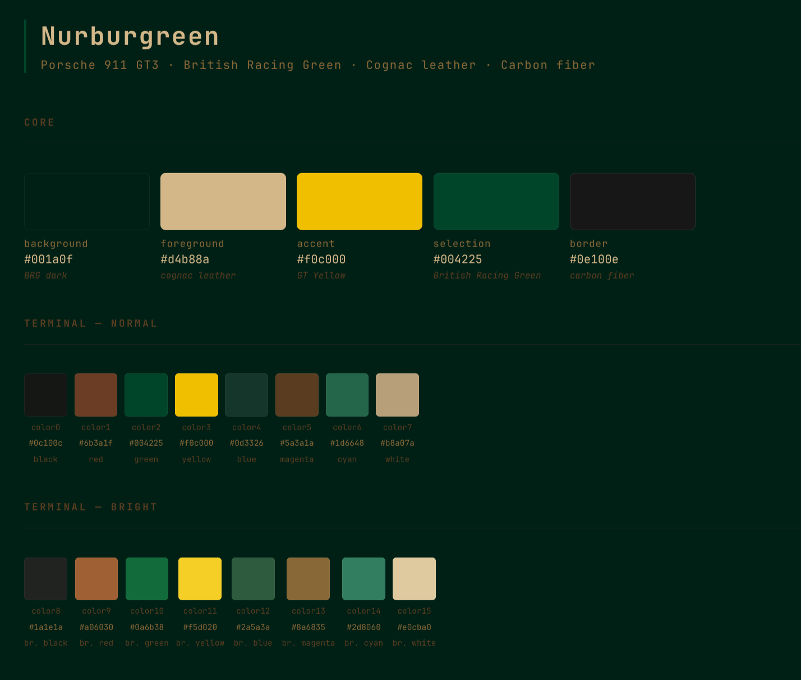

# dotdotdots

Mes dotfiles, sur deux machines :

| Machine | OS | Desktop | Profil |
|---|---|---|---|
| pro | Arch + [Omarchy](https://omarchy.org/) | Hyprland | `omarchy` |
| perso | Pop!_OS 24.04 | COSMIC | `popos` |

Le terminal, le thème et les outils CLI sont **identiques** sur les deux. Le
desktop ne l'est pas, et n'essaie pas de l'être.

---

## Installation

```bash
git clone git@github.com:brieucdlf/dotdotdots ~/.dotfiles
cd ~/.dotfiles && ./install.sh
```

Le script détecte le profil, installe les paquets manquants, stow les paquets,
rend le thème et lance `mise install`. Il est idempotent — relançable à volonté.
Tout fichier existant qui bloquerait stow est déplacé dans
`~/.dotfiles-backup/<horodatage>/`, jamais écrasé.

```bash
./install.sh --profile popos   # forcer un profil
./install.sh --no-packages     # stow + thème seulement
```

---

## Les trois couches

**La règle qui tranche : si ça tourne dans un terminal → `common/`. Si ça dépend
du compositeur ou du gestionnaire de paquets → un profil.**

```
common/            # les 2 machines, identique au byte près
├── .bashrc                     # loader : Omarchy si présent, puis init.bash
├── .gitconfig
├── .config/
│   ├── bash/init.bash          # socle shell indépendant de la distro
│   ├── bash/{exports,aliases,work}.bash
│   ├── ghostty/  tmux/  nvim/  starship.toml
│   ├── mise/config.toml        # ← versions des outils, la clé de l'iso
│   ├── claude/  zed/
└── .local/bin/                 # tmux-claude-status, dev-tmux, dots-shell-dump

theme/
├── nurburgreen/    # colors.toml = SOURCE UNIQUE des couleurs (+ ui.toml)
├── cosmic/         # palette sémantique stock de COSMIC, reprise telle quelle
└── render.sh       # → ~/.config/theme/current/{ghostty,tmux,colors.sh,*.ron}

omarchy/            # hypr/, waybar/, todo-popup, waybar-claude-todo
popos/              # thème COSMIC + override ghostty (voir son README)
```

`common/` et le profil sont stowés **en une seule invocation**
(`stow --restow common $PROFILE`) : traités séparément, stow refuse de déplier
un dossier posé par l'autre passage.

---

## Thème Nurburgreen

Construit autour d'une Porsche 911 GT3 en British Racing Green.



```
background  #001a0f   BRG dark
foreground  #d4b88a   cognac leather
accent      #f0c000   GT yellow (used sparingly)
```

`theme/nurburgreen/colors.toml` est la seule source de vérité. `theme/render.sh`
en dérive les fichiers consommés par ghostty, tmux, fzf et eza dans
`~/.config/theme/current/` — **aucune couleur n'est codée en dur dans une config**.
Les tokens qui n'existent pas dans le format Omarchy (bordures, fond de barre)
sont dans `ui.toml`, à côté.

Changer une couleur = éditer `colors.toml`, relancer `./install.sh --no-packages`.

Sur la machine Omarchy, `install.sh` lie aussi le thème dans le sélecteur Omarchy
pour que Waybar et Hyprland le voient. Le terminal, lui, ne dépend pas d'Omarchy :
c'est ce qui rend l'iso vraie.

Sur Pop!_OS, le desktop COSMIC a droit au même traitement : `render.sh` produit
un `cosmic-nurburgreen-dark.ron` importable via **Réglages > Apparence >
Importer un thème**. Détail du mapping dans `popos/README.md`.

---

## Iso des outils

`common/.config/mise/config.toml` fixe les versions de tout le socle CLI
(eza, fzf, zoxide, starship, delta, lazygit, fd, rg, btop, bat, gh, jq, neovim)
en plus des runtimes. Un `mise install` et les deux machines ont les mêmes
binaires, indépendamment d'apt et de pacman.

⚠️ Sur la machine Omarchy, les shims mise passent devant les binaires pacman.
C'est voulu.

Restent hors mise, installés par `install.sh` : **ghostty** (`.deb`
[mkasberg/ghostty-ubuntu](https://github.com/mkasberg/ghostty-ubuntu) sur Pop,
pacman sur Arch), **tmux**, **stow** et la **JetBrainsMono Nerd Font**.

### Vérifier que les deux machines ont convergé

Le socle shell vient d'Omarchy sur la machine pro et de `init.bash` sur Pop :
rien ne garantit qu'ils soient identiques. Pour rendre l'écart visible :

```bash
dots-shell-dump > ~/shell-$(hostname).txt   # sur chaque machine
diff ~/shell-pro.txt ~/shell-perso.txt
```

Ce qui manque côté Pop est à recopier dans `common/.config/bash/init.bash`.

---

## Machine-specific

Rien de tout ça n'est committé :

| Fichier | Usage |
|---|---|
| `~/.config/bash/local.bash` | secrets, clés API, overrides — sourcé en dernier |
| `~/.config/ghostty/local.conf` | `font-size` selon le DPI ; posé par le profil popos pour l'opacité |
| `~/.config/git/work.gitconfig` | identité pro, appliquée d'office sous `~/Work/` |
| `omarchy/.config/hypr/monitors.conf` | résolutions et scaling (committé, mais par profil) |

`work.bash` se charge seulement si `~/Work/bloomflow` existe — une machine
fraîche ne casse pas.

---

## Notes

- Omarchy gère le système de base. Ces dotfiles sont des overrides —
  `~/.local/share/omarchy/` n'est jamais touché.
- Hyprland recharge à chaud. Waybar demande `omarchy restart waybar`.
- tpm vit dans `~/.config/tmux/plugins` (XDG), pas `~/.tmux`.
