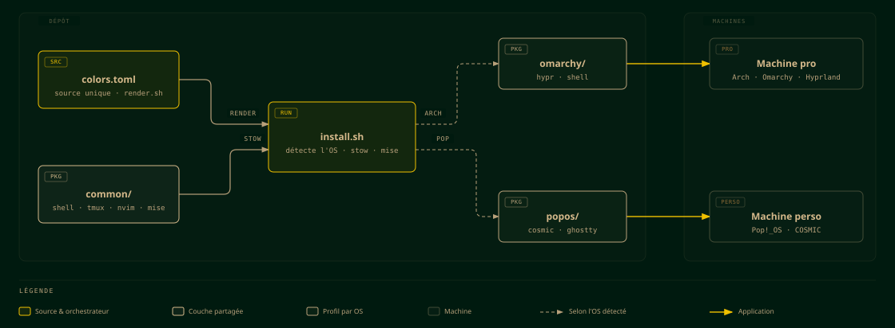
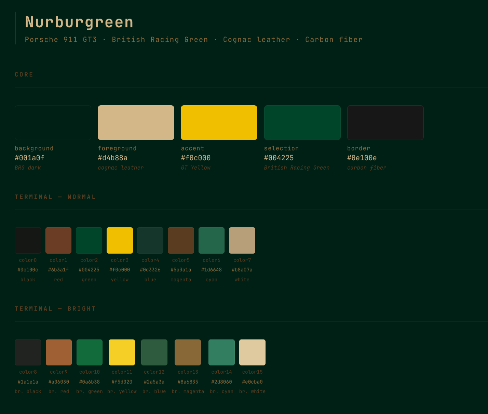

# dotdotdots

Mes dotfiles, sur deux machines :

| Machine | OS | Desktop | Profil |
|---|---|---|---|
| pro | Arch + [Omarchy](https://omarchy.org/) | Hyprland | `omarchy` |
| perso | Pop!_OS 24.04 | COSMIC | `popos` |

Le terminal, le thème et les outils CLI sont **identiques** sur les deux. Le
desktop ne l'est pas, et n'essaie pas de l'être.

---

## Installation

```bash
git clone https://github.com/brieucdlf/dotdotdots ~/.dotfiles
cd ~/.dotfiles && ./install.sh
```

**En HTTPS, et pas en SSH — l'ordre est contraint.** Cloner en SSH exigerait la
clé `sk`, que `ssh-keygen -K` régénère depuis la YubiKey, ce qui exige
`libfido2`, qu'installe `install.sh`, qui est dans le dépôt qu'on cherche à
cloner. La boucle ne s'ouvre que par HTTPS : le dépôt est public, la lecture
anonyme ne demande rien. Une fois les clés régénérées (voir *Sur une seconde
machine*), on bascule le remote :

```bash
git remote set-url origin git@github.com:brieucdlf/dotdotdots
```

C'est le sens de la bascule qui compte : lire n'a jamais besoin d'identité,
écrire en exige une. Rien d'autre dans ce dépôt ne doit dépendre d'un secret
pour être installé — sans quoi il cesse d'être ce qui suffit à refaire une
machine.

Le script détecte le profil, installe les paquets manquants, stow les paquets,
rend le thème et lance `mise install`. Il est idempotent — relançable à volonté.

Il déblaie aussi le terrain avant de stower, parce qu'un seul conflit fait
avorter stow **en entier** et laisse la machine sans ancienne config ni
nouvelle :

- tout ce qui existe déjà et bloquerait stow — vrai fichier, mais aussi lien
  posé par un autre outil, sur un fichier comme sur un dossier — part dans
  `~/.dotfiles-backup/<horodatage>/`, jamais écrasé ;
- les liens de `~` qui pointent dans le repo vers un chemin disparu (après un
  renommage, par exemple) sont retirés : ils ne contiennent rien.

Si stow refuse quand même, le script s'arrête en disant où sont les fichiers
écartés — plutôt que de mourir sur l'erreur brute de stow.

```bash
./install.sh --profile popos   # forcer un profil
./install.sh --no-packages     # stow + thème seulement
```

---

## Les trois couches



**La règle qui tranche : si ça tourne dans un terminal → `common/`. Si ça dépend
du compositeur ou du gestionnaire de paquets → un profil.**

```
common/            # les 2 machines, identique au byte près
├── .bashrc                     # loader : Omarchy si présent, puis init.bash
├── .gitconfig
├── .config/
│   ├── bash/init.bash          # socle shell indépendant de la distro
│   ├── bash/{exports,aliases,work}.bash
│   ├── ghostty/  tmux/  nvim/  starship.toml
│   ├── mise/config.toml        # ← versions des outils, la clé de l'iso
│   └── zed/
├── .claude/                    # config Claude Code (settings, skills, statusline)
└── .local/bin/                 # tmux-claude-status, dots-secrets, dots-shell-dump

theme/
├── nurburgreen/    # colors.toml = SOURCE UNIQUE des couleurs (+ ui.toml)
├── kreide/         # idem — tout dossier avec un colors.toml est un thème
├── cosmic/         # palette sémantique stock de COSMIC, reprise telle quelle
└── render.sh       # → ~/.config/theme/current/{ghostty,tmux,colors.sh,*.ron}

omarchy/            # hypr/ (Lua), omarchy/ (shell.json + gabarits de thème)
popos/              # thème COSMIC + override ghostty (voir son README)
```

`common/` et le profil sont stowés **en une seule invocation**
(`stow --restow common $PROFILE`) : traités séparément, stow refuse de déplier
un dossier posé par l'autre passage.

---

## Thèmes

Deux, et le dépôt en accepte d'autres : `install.sh` traite **tout dossier de
`theme/` qui contient un `colors.toml`**, le lie dans le sélecteur d'Omarchy, et
rend celui qui est ACTIF — pas un nom écrit en dur.

### Nurburgreen

Construit autour d'une Porsche 911 GT3 en British Racing Green.



```
background  #001a0f   BRG dark
foreground  #d4b88a   cognac leather
accent      #f0c000   GT yellow (used sparingly)
```

### Kreide

Une 911 GT3 RS craie : bitume mouillé, gris froids, un seul jaune d'étrier.

```
background  #15181a   bitume mouillé
foreground  #c9ccca   craie
accent      #e8b33c   étrier de frein
```

Le `colors.toml` du thème est la seule source de vérité. `theme/render.sh`
en dérive les fichiers consommés par ghostty, tmux, fzf, eza, btop et herdr dans
`~/.config/theme/current/` — **aucune couleur n'est codée en dur dans une config**.

Deux contraintes valent pour **tout** thème ajouté ici :

- son fond d'écran doit porter l'assombrissement du haut (la barre ne peint
  aucun fond — voir `theme/<nom>/assets/README.md`) ;
- ses clés `herdr_*` dans `ui.toml` doivent tenir 3:1 sur ses propres surfaces,
  les slots ANSI sombres n'y suffisent pas.
Les tokens qui ne concernent que `render.sh` (bordure de pane tmux, fond de
barre tmux, rampe neutre COSMIC) sont dans `ui.toml`, à côté.

Changer une couleur = éditer `colors.toml`, relancer `./install.sh --no-packages`.

Sur la machine Omarchy, `install.sh` lie aussi le thème dans le sélecteur
Omarchy, puis le réapplique — depuis la v4 les fichiers que lisent Hyprland, la
barre et le verrouillage ne sont plus *dans* le thème, ils en sont **dérivés**
au moment du `omarchy theme set` (voir « Omarchy 4 » plus bas). Le terminal,
lui, ne dépend pas d'Omarchy : c'est ce qui rend l'iso vraie.

Sur Pop!_OS, le desktop COSMIC a droit au même traitement : `render.sh` produit
un `cosmic-<thème>-dark.ron` importable via **Réglages > Apparence >
Importer un thème**. Détail du mapping dans `popos/README.md`.

## Multiplexeur

Le shell interactif attache **herdr** au démarrage — un serveur en arrière-plan
dans lequel les terminaux vivent, à la place de tmux et non dedans. `DOTS_MUX`
en décide :

| Valeur | Effet |
|---|---|
| *(vide)* | herdr, et tmux s'il n'est pas installé |
| `tmux` | l'ancien comportement |
| `none` | shell nu — `DOTS_NO_TMUX=1` fait pareil |

Le garde est `HERDR_PANE_ID`, ce que `TMUX` est à tmux : posé seulement dans un
pane. La conf tmux reste en place et thémée ; elle sert dès que `DOTS_MUX=tmux`.

---

## Omarchy 4

La machine pro est passée d'Omarchy 3 à 4. Ce n'est pas une montée de version
ordinaire : trois des quatre choses que le profil `omarchy/` posait ont changé
de **format** ou d'**adresse**. Ce que le dépôt contient a donc changé aussi.

| v3 | v4 | ce que ça change ici |
|---|---|---|
| `~/.config/hypr/*.conf` | `~/.config/hypr/*.lua` | tout le profil réécrit en Lua |
| waybar (`config.jsonc` + `style.css`) | shell Quickshell (`~/.config/omarchy/shell.json`) | les deux fichiers supprimés, un seul les remplace |
| `hypridle.conf` | `shell.json`, clé `idle` | le verrouillage n'est plus un démon à part |
| `hyprlock.conf` | plugin `omarchy.lock`, thémé | l'écran de verrouillage n'est plus dessinable à la main |
| `~/.config/omarchy/current/` | `~/.local/state/omarchy/current/` | ce qui est *généré* quitte `~/.config` |
| `~/.local/share/omarchy/` | `/usr/share/omarchy/` | Omarchy est un paquet pacman ; l'ancien chemin n'est plus qu'un lien |

### Le profil ne contient plus que des overrides

En v3, `bindings.conf` et `input.conf` étaient les fichiers **stock** d'Omarchy
recopiés, avec quelques lignes à soi noyées dedans. C'est ce qui a rendu cette
migration longue : il a fallu rejouer la comparaison ligne à ligne avec les
défauts de la v4 pour savoir ce qui était un choix et ce qui était un héritage.

Il en restait très peu. `bindings.lua` tient en une ligne (btop sur
`Super+Shift+T` ; Omarchy 4 le met sur `Super+Ctrl+T`, les deux coexistent) et
`input.lua` en quatre valeurs (`us,fr`, `repeat_delay`, deux réglages de
touchpad). Tout le reste était devenu, ou était déjà, le défaut.

**La règle qui en découle : ne rien recopier d'Omarchy « pour la lisibilité ».**
Une valeur redite dans le profil fige le défaut du jour et ne bougera plus
jamais avec les mises à jour, sans que rien ne le signale.

### Les couleurs sont remontées dans le thème

Le moteur de gabarits de la v4 expose **toute** clé de `colors.toml` aux
templates de `default/themed/`. Deux conséquences :

- les bordures de fenêtres sortent de `looknfeel.lua` et deviennent
  `hyprland_active_border` / `hyprland_inactive_border` dans `colors.toml`.
  Elles appartiennent au thème, pas au compositeur — et surtout, `looknfeel.lua`
  est chargé **après** le thème : y laisser `col.active_border` écrasait
  n'importe quel thème, y compris après en avoir changé ;
- ce qui reste dans `ui.toml` n'y est plus parce qu'Omarchy « ne saurait pas le
  lire », mais parce qu'Omarchy n'a aucune raison de le voir (tmux, COSMIC).

La barre et le verrouillage se thèment par des **sections** de `shell.toml`,
déposées en gabarits dans `omarchy/.config/omarchy/themed/` :
`shell.bar.toml.tpl` (barre sans aucun fond — l'assombrissement est cuit dans
le fond d'écran du thème, voir `theme/kreide/assets/README.md`) et
`shell.lock.toml.tpl` (couleur d'échec lisible). Ils sont rendus depuis
`colors.toml` — donc valables pour **tous** les thèmes, et sans une couleur en
dur. Contrepartie : Omarchy remplace la section entière, pas clé par clé ; une
clé `[bar]` ajoutée en amont ne parviendra pas tant qu'elle n'est pas reprise.

### Ce qui est perdu, et assumé

- **La carte de verre dépoli du verrouillage.** L'ancien `hyprlock.conf`
  dessinait une carte arrondie, la photo de profil et une horloge en 64 px. Le
  plugin `omarchy.lock` ne se règle que par des couleurs : le fond d'écran, un
  champ de saisie, rien d'autre. Seule la palette a été reportée.
- **Le module CPU de la barre.** Il n'a pas d'équivalent en v4 ; `Super+Shift+T`
  ouvre toujours btop, ce que faisait le clic sur le module.
- **`hypridle`, à la seconde près.** La v4 n'a pas de « verrouiller sans
  économiseur » : `idle.screensaver` et `idle.lock` sont deux délais, pas un
  interrupteur, et un délai nul déclenche l'économiseur *immédiatement* au lieu
  de l'éteindre. Les deux sont donc posés à 120 s : le délai de verrouillage de
  la v3 est conservé exact, rien ne se passe avant, et l'économiseur qui
  démarre au même instant est tué par `omarchy-system-lock` dans la foulée.

### Le lanceur vit dans un dépôt à part

`shell.json` déclare le plugin `brieuc.launcher`, `hypr/bindings.lua` lui donne
`SUPER + A`, `looknfeel.lua` floute sa couche et
`themed/shell.launcher.toml.tpl` l'habille. **Le plugin lui-même n'est pas
ici** : il vit dans son propre dépôt, cloné vers
`~/.config/omarchy/plugins/brieuc.launcher/`.

`install.sh` ne l'installe pas, exprès — écrire dans
`~/.config/omarchy/plugins/` recharge à chaud TOUS les plugins du shell, y
compris le verrouillage, et un script d'install n'a pas à déclencher ça. Il se
contente de dire ce qui manque : chaque id de `shell.json` sans dossier
correspondant sort en `warn`. Sur une machine neuve, cloner le dépôt du plugin
à cet emplacement, puis `omarchy-shell shell rescanPlugins`.

`launcher_rail` reste dans les `colors.toml` pour le plugin, mais **pas** dans
le gabarit partagé : `~/.config/omarchy/themed/` est rendu pour tous les
thèmes, y compris ceux d'Omarchy, qui n'ont pas cette clé — le moteur y
laisserait le gabarit non substitué.

### shell.json est réécrit par le shell

`~/.config/omarchy/shell.json` est stowé comme le reste, mais le shell le
réécrit lui-même en temp + rename (`atomicWrites: true`) : **chaque** réglage de
barre — déplacer un widget, `omarchy bar …` — remplace le lien par un vrai
fichier et arrête la synchro sans rien dire. `install.sh` récupère le contenu
au passage suivant, comme il le fait pour `~/.claude/settings.json`.

---

## Iso des outils

`common/.config/mise/config.toml` fixe les versions de tout le socle CLI
(eza, fzf, zoxide, starship, delta, lazygit, fd, rg, btop, bat, gh, jq, neovim)
en plus des runtimes. Un `mise install` et les deux machines ont les mêmes
binaires, indépendamment d'apt et de pacman.

⚠️ Sur la machine Omarchy, les shims mise passent devant les binaires pacman.
C'est voulu.

Restent hors mise, installés par `install.sh` : **ghostty** (`.deb`
[mkasberg/ghostty-ubuntu](https://github.com/mkasberg/ghostty-ubuntu) sur Pop,
pacman sur Arch), **tmux**, **stow** et la **JetBrainsMono Nerd Font**.

### Vérifier que les deux machines ont convergé

Le socle shell vient d'Omarchy sur la machine pro et de `init.bash` sur Pop :
rien ne garantit qu'ils soient identiques. Pour rendre l'écart visible :

```bash
dots-shell-dump > ~/shell-$(hostname).txt   # sur chaque machine
diff ~/shell-pro.txt ~/shell-perso.txt
```

Ce qui manque côté Pop est à recopier dans `common/.config/bash/init.bash`.

---

## Secrets

Les clés API et l'identité pro sont **chiffrées dans le repo**, et ne s'ouvrent
qu'avec une YubiKey. La clé privée `age` est générée dans l'applet PIV du token
et n'en sort jamais : il n'y a rien à sauvegarder ailleurs, et un vol de machine
ne donne accès à rien.

C'est ce qui ferme la boucle du reset — avant, un poste neuf retrouvait un shell
parfait mais aucune clé, et il fallait les recopier à la main depuis on ne sait où.

```bash
dots-secrets status            # état de la chaîne
dots-secrets verify            # prouver que la clé branchée ouvre tout
dots-secrets edit local.bash   # éditer un secret (le clair reste en tmpfs)
dots-secrets unseal            # (re)déposer les secrets sur la machine
dots-secrets enroll            # enrôler une YubiKey de plus
```

`./install.sh` déchiffre tout seul si la clé est branchée, et se termine quand
même sinon. Détail du modèle, ajout d'un secret, perte d'une clé :
[`secrets/README.md`](secrets/README.md).

`ykman` est installé avec le reste : c'est le seul outil qui inspecte et
reconfigure les applets du token — lister les identifiants résidents, remettre
un PIN, lire le numéro de série. Rien ici n'en dépend au quotidien, mais sans
lui un token qui se comporte mal est une boîte noire.

Il sert notamment à retirer l'**applet OTP** si elle n'est pas utilisée
(`ykman otp delete 1`). Cette applet tape une longue chaîne à chaque touche
reçue *hors* d'une demande FIDO — donc dans un terminal, un champ de mot de
passe ou une messagerie, selon ce qui a le focus. Sur un token qui ne sert
qu'au FIDO et au PIV, elle ne fait que transformer une touche mal placée en
accident au lieu d'un non-événement.

La chaîne ne sert pas qu'aux fichiers de configuration. `todo-secu` y range les
**faiblesses connues et non corrigées** — une liste de trous ouverts est une
carte, pas une note de travail : elle dit par où entrer et ce qui n'est pas
surveillé. Le reste du dépôt peut rester public sans dommage ; publier qu'on
utilise Tailscale et une YubiKey n'affaiblit rien, la sécurité ne tenant pas au
secret du dispositif.

---

## SSH

`~/.ssh/config` est versionné ; les clés ne le sont jamais. **github.com
n'accepte plus que les YubiKeys** — une par token, `-usbc` au quotidien,
`-usba` au coffre. Pousser exige une présence physique, la clé privée ne
sortant jamais de l'applet FIDO.

L'épinglage dans `config` ne suffisait pas : c'est une préférence locale, et
GitHub continuait d'accepter la clé logicielle. Quiconque volait le fichier
écrivait sa propre config et poussait. La clé logicielle a donc été **retirée
du compte** — c'est ce retrait, pas le fichier de config, qui rend la règle
réelle. Elle reste en service pour tous les autres hôtes.

Les clés sont **résidentes** : le token est sa propre sauvegarde. Sur une
machine neuve, `ssh-keygen -K` les régénère depuis la YubiKey — rien à mettre
dans `secrets/`, et pas d'amorce circulaire (pas de clé SSH enfermée dans le
dépôt qu'il faudrait SSH pour cloner). Leurs noms de fichier sont laids exprès :
ce sont ceux que `-K` recrée seul à partir de la chaîne `application`.

```
$ git push          # sans le token
sign_and_send_pubkey: signing failed for ED25519-SK — agent refused operation
git@github.com: Permission denied (publickey).
```

C'est le comportement voulu, pas une panne. Le multiplexage garde la connexion
10 min : un seul touch pour une rafale de commandes.

**Le même message veut dire deux choses.** `agent refused operation` sort aussi
bien quand aucun token n'est branché que quand le bon token est branché mais
n'a pas été touché dans la fenêtre. Le seul moyen de les distinguer est la
durée : un refus immédiat, c'est l'absence de token ; un refus après ~20 s par
clé, c'est un touch manqué. Avec deux `IdentityFile`, ssh les essaie l'une
après l'autre — d'où ~40 s avant le `Permission denied` final.

```bash
time git push    # ~0 s : pas de token. ~40 s : personne n'a touché.
```

Corollaire pratique : ce n'est pas automatisable. Une commande lancée par un
agent, un cron ou un script attend un doigt qui n'arrive jamais et échoue au
bout de 40 s. Le push est un geste manuel, par construction.

Enfin, hors terminal, ssh ne demande pas la passphrase lui-même : il délègue à
un askpass externe, et sans askpass il abandonne **sans rien afficher**.
`install.sh` installe donc `ssh-askpass-gnome` (Pop!_OS) ou `ksshaskpass`
(Arch), et `init.bash` pose `SSH_ASKPASS` sur le premier des deux qui existe.
Tant que gnome-keyring détient les passphrases le manque ne se voit pas — il
se voit le jour où un agent propre doit charger une clé sans tty.

Le fichier a un piège documenté sur place — `IdentityFile` est la seule option
d'un `ssh_config` qui soit **cumulative** au lieu de premier-gagnant. Mise dans
`Host *`, la clé logicielle s'ajouterait à celle de github.com et ssh
retomberait dessus dès le token absent, ce qui annulerait l'épinglage. D'où le
bloc négatif `Host * !github.com`. Le contrôle tient en une commande :

```bash
ssh -G github.com | grep '^identityfile' | grep -c heartbeat   # doit valoir 0
```

Le contrôle porte sur la nature des clés, pas sur leur nombre : github.com en
liste deux, une par YubiKey. Ce qui doit être absent, c'est la clé logicielle.

Les hôtes de travail ne sont **pas** dans le fichier versionné : une IP, un
compte ou même un alias désignent une infra interne, et le dépôt est public.
Ils vivent dans `~/.ssh/config.local`, tiré par un `Include` en **tête** de
`config` — premier-gagnant oblige, placé en bas il n'aurait rien pu redresser.
Un Include absent n'est pas une erreur pour ssh : les machines qui n'ont pas ce
fichier ne voient rien.

Un hôte déclaré là doit nommer sa propre clé. Le bloc négatif ne propose que
`id_ed25519_heartbeat`, et `IdentitiesOnly yes` interdit tout le reste : sans
`IdentityFile` local, ssh se présente les mains vides et le serveur refuse
(`Permission denied (publickey)`), précédé du révélateur `no such identity`
quand la clé logicielle générique n'existe pas non plus sur cette machine.

`install.sh` crée `~/.ssh` en **vrai dossier** avant de stower. Sans ça, stow le
plierait en un lien vers le dépôt et le premier `ssh-keygen` écrirait une clé
privée dans un dépôt public. `.gitignore` couvre le cas en second rideau :
`common/.ssh/*` est refusé par défaut, seul `config` est suivi.

---

## Signature des commits

Chaque commit est signé **par SSH**, avec la même YubiKey qui authentifie.
Un commit à ton nom exige donc une présence physique : une machine compromise
ne peut pas en fabriquer.

Par SSH et non par GPG, pour deux raisons. Aucune clé à faire expirer — la GPG
de ce dépôt l'a fait, sans prévenir. Et la clé matérielle est déjà là : une
seule chose à protéger plutôt que deux.

`user.signingkey` vit dans `identity.gitconfig`, chiffré, et pas dans le
`.gitconfig` committé : c'est un choix de **poste**, chaque machine nommant le
token qu'elle a sous la main.

`allowed_signers` est ce qui permet de *vérifier* et pas seulement de signer —
sans lui git n'a aucun moyen de relier une adresse à une clé publique :

```bash
git log --show-signature -1
git verify-commit HEAD
```

Le `namespaces="git"` y cantonne la confiance à la signature de commits. La
même clé sert à s'authentifier auprès de GitHub, et une clé valable partout est
une clé qu'on ne peut pas révoquer pour un seul usage.

**Le coût est un touch par commit**, y compris à chaque commit rejoué par un
rebase. Pour une opération en lot :

```bash
git -c commit.gpgsign=false rebase ...
```

### Si la clé du quotidien est perdue

Git ne prend **qu'une** clé de signature, sans repli — contrairement à
l'authentification SSH qui essaie une liste. La YubiKey de secours est déjà
enregistrée chez GitHub en type `signing`, donc la bascule tient en une ligne :

```bash
# dans ~/.config/git/identity.gitconfig
signingkey = ~/.ssh/id_ed25519_sk_rk_github-usba.pub

dots-secrets seal identity.gitconfig   # aucun token requis
```

Rien à faire côté GitHub, aucun commit à re-signer. C'est tout l'intérêt
d'avoir enregistré les deux clés pendant que tout allait bien : le jour de la
panne, il ne reste qu'un fichier à éditer, pas un compte à manipuler.

---

## Mises à jour

Sur Pop!_OS, les correctifs de **sécurité** s'installent seuls. Les timers
`apt-daily` et `apt-daily-upgrade` tournaient déjà — le paquet `apt` les arme
d'office — mais sans `unattended-upgrades` ils n'avaient rien à exécuter, et
sans `APT::Periodic` dans `20auto-upgrades` le paquet lui-même ne fait rien.
`install.sh` pose les deux.

Restent volontairement désactivés : le **redémarrage automatique**, qui ferait
perdre du travail sur un poste de bureau (les correctifs de noyau attendent
donc un reboot manuel), et tout ce qui dépasse les dépôts de sécurité — un
poste ne doit pas changer de version majeure pendant la nuit.

Côté Omarchy, **rien n'est automatisé, et c'est délibéré**. Arch n'a pas de
dépôt de sécurité séparé : automatiser reviendrait à lancer un `pacman -Syu`
complet sans surveillance, avec son risque de mise à jour partielle et ses
interventions manuelles annoncées sur la page d'accueil. Sur Arch, mettre à
jour reste un geste conscient.

---

## Détection de fuites

`.gitignore`, le filtre `autoMode` et le hook `pre-commit` ne couvrent que les
fuites **anticipées** : un chemin qu'on a pensé à interdire. `gitleaks` regarde
le contenu, pas le nom du fichier. C'est la différence entre une liste
d'interdits et une relecture.

Le scan tourne au `pre-commit`, sur l'index, et **refuse le commit** en cas de
trouvaille — comme il refuse de s'exécuter si `gitleaks` est absent. Laisser
passer dans ce cas donnerait précisément l'illusion d'être couvert.

`install.sh` prend le **binaire amont** sur Pop!\_OS, pas le paquet apt :
Ubuntu livre 8.16 (mi-2023), dont le jeu de règles ignore par exemple les clés
Anthropic — vérifié. Pour un scanner, la fraîcheur des règles *est* la
fonction. L'archive est vérifiée par empreinte SHA256 avant installation : un
outil censé ne pas faire confiance au reste ne peut pas se fier au transfert.
Côté Arch le dépôt suit l'amont, le paquet suffit.

`.gitleaks.toml` n'écarte que des faux positifs **structurels** : les `.age`
(du chiffré, haute entropie par construction — les signaler reviendrait à
signaler que le coffre est bien fermé), les clés publiques `age` et SSH, les
`.sample`, et les plugins tmux vendorisés. Rien n'y nomme d'employeur ni de
point d'accès : le fichier est committé, une règle taillée sur un secret précis
le décrirait.

**Un secret committé ne se supprime pas, il se révoque.** Réécrire l'historique
ne rattrape ni les clones, ni les forks, ni les caches. C'est pour ça que le
filet est au `pre-commit` et pas ailleurs : après, il est trop tard, et le seul
recours est la rotation de la clé.

```bash
gitleaks git --redact -c .gitleaks.toml .    # tout l'historique
gitleaks dir --redact -c .gitleaks.toml .    # l'arbre courant
```

---

## Accès distant

Tout le reste de ce dépôt organise des flux **sortants**. Ici on ouvre une
porte, et la forme de la porte compte plus que ses réglages.

Il n'y a **pas d'`openssh-server`** sur ces machines, et rien n'écoute sur le
LAN ni sur Internet. L'accès passe par le SSH intégré à Tailscale, qui
authentifie par l'**identité du pair dans le réseau maillé** — pas par une clé
posée sur le client. C'est la seule raison de ce choix : depuis Android, une
YubiKey est inutilisable en SSH (l'OpenSSH de Termux est compilé sans FIDO, et
l'accès USB-HID ou NFC au token n'est pas ouvert aux applis non root). Un
`authorized_keys` classique aurait donc signifié déposer sur le téléphone
exactement la clé logicielle qu'on vient de retirer de GitHub. Avec Tailscale
SSH, **il n'y a pas de clé sur le téléphone du tout** : l'identité est celle de
l'appareil dans le réseau, adossée à ton fournisseur d'identité — que tu peux
protéger par la YubiKey en passkey. La chaîne matérielle est rétablie par un
autre chemin.

`install.sh` installe Tailscale et active le démon, mais ne lance **jamais**
`tailscale up` : rattacher une machine à un réseau est une décision, pas une
étape d'installation. À faire à la main, une fois par machine :

```bash
sudo tailscale up --ssh          # rattache la machine ET active le SSH Tailscale
tailscale status                 # vérifier qui est joignable
```

Côté téléphone : l'application Tailscale, plus n'importe quel client SSH
(Termux). Aucune clé à générer.

Dans les ACL du réseau, restreindre l'usage à tes propres appareils et exiger
une ré-authentification périodique plutôt qu'un accès permanent :

```jsonc
"ssh": [
  {
    "action": "check",           // "accept" = permanent ; "check" = ré-auth
    "checkPeriod": "12h",        // au-delà, le navigateur redemande l'identité
    "src":  ["autogroup:member"],
    "dst":  ["autogroup:self"],
    "users": ["autogroup:nonroot"]
  }
]
```

`check` est le point important : sans lui, un téléphone volé et déverrouillé
donne un shell permanent. Avec, il redemande l'identité — donc la passkey.

Pour piloter une session de travail depuis le téléphone, se rattacher à un tmux
existant plutôt qu'ouvrir un shell neuf :

```bash
ssh <machine> -t 'tmux new -A -s phone'
```

`new -A` rattache la session si elle existe, la crée sinon : la même session
survit aux coupures réseau, qui sont la règle en mobilité.

### Le poste fixe ne dort plus

Une machine endormie n'a pas de `tailscaled` éveillé : **elle est injoignable,
et aucun réglage sur la machine n'y change rien.** Le Wake-on-LAN se fait par
un paquet envoyé sur le réseau LOCAL, ce qui suppose un appareil déjà allumé
pour l'émettre — un Raspberry Pi, un NAS, une box qui sache le faire. Il n'y en
a pas ici.

Le choix est donc assumé : `install.sh` désactive la **suspension
automatique** sur le poste fixe, en écrivant `None` dans le réglage COSMIC
`CosmicIdle/v1/suspend_on_ac_time`. L'écran continue de s'éteindre au bout de
30 min — c'est l'essentiel de l'économie, et ça ne coupe pas le réseau. Seule
la suspension disparaît.

C'est le seul endroit du dépôt où l'accès distant coûte quelque chose : la
consommation d'un fixe qui ne s'endort plus. Le contraire aurait coûté un
accès qui marche une fois sur deux, ce qui ne vaut rien.

Le réglage ne s'applique **qu'à un châssis de bureau** (types DMI 3/4/6/7) :
sur un portable la suspension est un service rendu, et le profil `popos`
pourrait un jour tourner ailleurs que sur cette tour.

Vérifier que ça tient — l'écriture du fichier ne prouve rien, seule l'absence
de suspension le prouve :

```bash
cat ~/.config/cosmic/com.system76.CosmicIdle/v1/suspend_on_ac_time   # -> None
journalctl --since "7 days ago" | grep -c "PM: suspend entry"        # -> 0
```

Avant ce changement, cette machine s'endormait **14 fois par mois**.

---

## Caméra

Une StreamCam est branchée sur le poste fixe. `dots-cam` permet de l'allumer
depuis le téléphone — à travers le réseau maillé, jamais autrement.

```bash
dots-cam snap [fichier]     # une image, la caméra se referme aussitôt
dots-cam start [secondes]   # flux MJPEG, 30 min par défaut
dots-cam stop
dots-cam status
```

Le flux s'ouvre sur `http://<adresse-tailscale>:8080/`, lisible dans le
navigateur du téléphone sans rien installer.

Trois propriétés, et ce sont elles qui ont dicté le code :

**Éteinte par défaut.** Rien n'est `enable`, rien ne démarre au boot. Le flux
est une unité systemd *transitoire* : elle n'existe pas tant qu'on ne l'a pas
demandée et disparaît en s'arrêtant. Il n'y a pas d'état oublié quelque part.

**Jamais hors du réseau maillé.** Le flux se lie à l'adresse Tailscale, et le
script **refuse de démarrer** si elle n'existe pas. Se lier à `0.0.0.0` « en
attendant » offrirait la caméra au réseau local entier — exactement le repli
commode que ce dépôt passe son temps à retirer.

**Extinction automatique.** `RuntimeMaxSec` coupe au bout du délai, que la
connexion ait tenu ou non. Le risque n'est pas d'allumer une caméra, c'est de
la laisser allumée.

S'y ajoute un témoin que le logiciel ne contrôle pas : la LED blanche de la
StreamCam est allumée tant que le capteur diffuse. Aucune commande de ce dépôt
ne l'éteint. Chaque allumage laisse par ailleurs une trace dans le journal
systemd, l'unité y étant nommée.

`install.sh` ajoute l'utilisateur au groupe **`video`**, et ça n'est pas du
confort : sans lui, l'accès à `/dev/video0` ne tient qu'à l'ACL que `logind`
pose pour la session graphique *active*. La caméra marcherait tant qu'on est
assis devant, et échouerait précisément quand on est loin — le seul moment où
elle sert. **Une reconnexion est nécessaire** pour que le groupe prenne effet.

Le mode `snap` est le moins exposé des deux : la caméra s'ouvre le temps d'une
image et se referme, rien n'écoute sur le réseau. Si le flux tourne déjà, la
capture lui est demandée à lui plutôt que d'échouer sur un « device busy »
incompréhensible.

Côté Omarchy, rien : la caméra est sur le fixe, et `ustreamer` n'est pas dans
les dépôts officiels d'Arch.

---

## Machine-specific

Le clair de ces fichiers n'est jamais committé. Certains sont restaurables
depuis leur version chiffrée, les autres sont propres à la machine et doivent
être réécrits à la main :

| Fichier | Usage | Après un reset |
|---|---|---|
| `~/.config/bash/local.bash` | secrets, clés API, overrides — sourcé en dernier | déchiffré |
| `~/.config/bash/work.bash` | aliases pro : noms de projets internes | `.sample` à recopier |
| `~/.config/git/identity.gitconfig` | nom et email git | déchiffré |
| `~/.config/zed/mcp.json` | serveurs MCP de Zed (endpoints internes) | `.sample` à recopier |
| `~/.local/bin/dev-tmux` | lanceur de session tmux propre au boulot | à réécrire |
| `~/.config/ghostty/local.conf` | `font-size` selon le DPI ; posé par le profil popos pour l'opacité | à refaire (dépend de l'écran) |
| `~/.config/git/work.gitconfig` | identité pro, appliquée d'office sous `~/Work/` | déchiffré |
| `omarchy/.config/hypr/monitors.lua` | résolutions et scaling (committé, mais par profil) | committé |
| `common/.claude/settings.private.json` | bloc `autoMode` de Claude Code, extrait par le filtre git | régénéré par le filtre |

Chacun a son `.sample` committé à côté, qui montre la structure sans nommer
l'employeur, les projets internes ni l'identité. `work.bash` n'est chargé que
s'il existe — une machine fraîche ne casse pas.

### Sur une seconde machine

Aucune clé ne se copie d'une machine à l'autre — ni par clé USB, ni par le
dépôt. Les `sk` sont des *handles* : la clé privée ne quitte jamais l'applet
FIDO, et le token la redonne à la demande. Après le clone :

```bash
./install.sh                 # ~/.ssh en vrai dossier + sockets, pcscd, askpass
dots-secrets unseal          # YubiKey PIV : identity.gitconfig, local.bash…
cd ~/.ssh && ssh-keygen -K   # YubiKey FIDO : régénère la sk du token branché
chmod 600 ~/.ssh/id_ed25519_sk_rk_github-*
```

Sur Arch, `ssh-keygen -K` échoue tant que **`libfido2`** manque : Debian en
fait une dépendance dure d'`openssh-client`, Arch une simple `optdepend`. Le
message ne parle ni de FIDO ni de YubiKey (`libfido2.so.1: cannot open shared
object file`, puis `unexpected internal error`) et arrive *après* le PIN, ce
qui laisse croire à un problème de token. `install.sh` l'installe.

`ssh-keygen -K` écrit dans le **répertoire courant** — d'où le `cd`, sans quoi
les fichiers atterrissent dans le dépôt. Il ne rend que les identifiants du
token branché : une seule YubiKey suffit, l'autre se régénère le jour où on la
branche. Les noms recréés sont ceux qu'attend déjà `~/.ssh/config`, il n'y a
donc rien à renommer ni à éditer.

Ce qui reste propre à la machine : `~/.ssh/id_ed25519_heartbeat` (clé
logicielle pour les autres hôtes), `~/.ssh/config.local` (hôtes de travail,
voir « SSH ») et les fichiers marqués « à réécrire » ou « `.sample` à
recopier » ci-dessus.

---

## Claude Code

`~/.claude/` est stowé depuis `common/.claude/` : `settings.json`, les skills
perso et la statusline suivent d'une machine à l'autre.

⚠️ Le chemin qui compte est `~/.claude/`, **pas** `~/.config/claude/` — Claude
Code ne lit jamais ce dernier. Il n'existe pas non plus de
`~/.claude/settings.local.json` : le suffixe `.local` n'a de sens qu'au niveau
d'un projet.

`~/.claude/settings.json` est un **lien** vers le dépôt, et c'est volontaire :
Claude Code écrit lui-même dans ce fichier (`/config`, thème, effort, plugins
activés), donc ses réglages atterrissent directement dans le dépôt, prêts à
committer. S'il venait à remplacer le lien par un vrai fichier — écriture
atomique, comme `cosmic-settings` —, `install.sh` récupère le contenu et
re-soude le lien.

Ne sont **pas** suivis : les serveurs MCP (ils vivent dans `~/.claude.json`,
mélangés à l'OAuth et aux caches, chaînes de connexion en clair), l'historique
(`projects/`, 169 Mo), les plugins (ils se réinstallent seuls depuis
`enabledPlugins`). Sur une machine neuve, les MCP sont à rejouer à la main :

```bash
claude mcp add anytype ...
claude mcp add mongodb ...
```

### Le bloc autoMode et le filtre git

Ce dépôt est **public**, et `settings.json` porte un bloc `autoMode.environment`
qui décrit l'environnement de travail (dépôt privé, bases Notion, politique de
traitement des données personnelles). Un filtre git le retire :

| | |
|---|---|
| `.gitattributes` | associe le fichier au filtre `claude-settings` |
| `.githooks/claude-settings-filter` | `clean` retire le bloc et l'archive ; `smudge` le réinjecte |
| `common/.claude/settings.private.json` | l'archive, gitignorée |
| `.githooks/pre-commit` | refuse le commit si le bloc atteint quand même l'index |

Les deux sens comptent. Sans `smudge`, le filtre serait **destructeur** : un
`git stash`, un `git checkout` ou un `reset --hard` fait transiter le fichier par
l'index et le bloc disparaîtrait de la config vivante, sans un mot.

`install.sh` configure le tout (`filter.claude-settings.*`, `core.hooksPath`),
avec `required = true` — un `jq` absent fait échouer l'indexation au lieu de
publier le fichier brut. **Un clone sur lequel `install.sh` n'a pas tourné n'a
pas cette protection** : le hook `pre-commit` est là pour ce cas.

### La statusline

`common/.claude/statusline.sh` affiche modèle, effort, contexte, quotas 5 h et
7 j, coût et branche. Les trois derniers ne s'inventent pas : `rate_limits`,
`cost.total_cost_usd` et `context_window.used_percentage` ne sont exposés qu'au
**stdin de la statusline**, ni par la CLI ni par les transcripts.

Le panneau tmux qui les relisait a été retiré : les agents en cours et la conso
se lisent dans le module `omarchy.agents` de la barre, et le multiplexeur est
herdr (voir « Multiplexeur »).

Contrepartie : avec une statusline active, Claude Code masque la plupart des
rappels de raccourcis du footer (dont `esc to interrupt`). Retirer la clé
`statusLine` de `settings.json` les fait revenir.

---

## Notes

- Omarchy gère le système de base. Ces dotfiles sont des overrides —
  `/usr/share/omarchy/` n'est jamais touché (v3 : `~/.local/share/omarchy/`,
  aujourd'hui un simple lien vers le premier).
- Hyprland recharge à chaud. `shell.json` et les plugins aussi. Les couleurs
  passent par `omarchy theme set nurburgreen`, pas par un redémarrage.
- tpm vit dans `~/.config/tmux/plugins` (XDG), pas `~/.tmux`.
